# 📊 Business Analytics Agent with LangGraph

> **A powerful business intelligence system that automatically analyzes your business data and provides AI-driven insights and recommendations.**

[English](#english) | [فارسی](#persian)

---

## English

### 🎯 Overview

This project is an intelligent business analytics agent built with **LangGraph** that processes daily business data, calculates key performance metrics, and generates actionable insights using AI. Perfect for small to medium businesses that need automated business intelligence.

### ✨ Key Features

- **🔄 Automated Analysis Pipeline**: Five-node graph that processes data automatically
- **📊 Key Metrics Calculation**: Profit, CAC, ROI, growth rates, and more
- **🚨 Smart Alerts**: Automatic warnings for critical business conditions
- **🤖 AI-Powered Recommendations**: LLM-generated actionable business advice
- **📱 Multiple Interfaces**: CLI, LangGraph Studio, and API-ready
- **🛡️ Secure**: No hardcoded API keys, environment-based configuration

### 🏗️ Architecture

```mermaid
graph LR
    A[📊 Input Node] --> B[⚙️ Processing Node]
    B --> C[🔍 Analysis Node]
    C --> D[💡 Recommendation Node]
    D --> E[📋 Output Node]
    E --> F[🏁 END]
```



#### Node Functions

| Node | Purpose | Key Operations |
|------|---------|----------------|
| **Input** | Data ingestion | Validates and structures business data |
| **Processing** | Metric calculation | Computes profit, CAC, ROI, growth rates |
| **Analysis** | Alert generation | Identifies critical business conditions |
| **Recommendation** | AI insights | Generates actionable recommendations via LLM |
| **Output** | Report creation | Produces structured JSON business report |

### 📊 Calculated Metrics

#### Financial Metrics
- **Profit/Loss**: `Revenue - Cost`
- **ROI**: `(Profit / Cost) × 100`
- **Profit Margin**: `(Profit / Revenue) × 100`

#### Customer Metrics
- **CAC (Customer Acquisition Cost)**: `Marketing Cost / New Customers`
- **Customer Growth**: `((Today - Yesterday) / Yesterday) × 100`

#### Performance Indicators
- **Revenue Growth**: Day-over-day percentage change
- **Cost Efficiency**: Cost vs revenue growth analysis
- **Marketing ROI**: Marketing spend effectiveness

### 🚨 Alert System

| Alert Type | Trigger | Priority |
|------------|---------|----------|
| 🚨 **CRITICAL** | Profit ≤ 0 | High |
| ⚠️ **WARNING** | CAC increase > 20% | Medium |
| 🔍 **ALERT** | CAC > $50 | Medium |
| 📉 **URGENT** | Revenue drop > 10% | High |
| 💰 **LOW ROI** | ROI < 10% | Medium |

### 🚀 Quick Start

#### Prerequisites
- Python 3.8+
- OpenAI API key
- Git

#### Installation

1. **Clone the repository:**
```bash
git clone https://github.com/edvinbehdadi/business_agent.git
cd business_agent
```

2. **Install dependencies:**
```bash
pip install -r requirements.txt
```

3. **Setup environment:**
```bash
# Create .env file
cp .env.example .env

# Add your OpenAI API key to .env
OPENAI_API_KEY=your_openai_api_key_here
```

4. **Run the system:**
```bash
# Direct execution
python main.py

# Or with LangGraph Studio
langgraph dev
```

### 📋 Usage Examples

#### Sample Input Data
```python
today_data = {
    "revenue": 12000,
    "cost": 8000,
    "customers": 150,
    "marketing_cost": 2000
}

yesterday_data = {
    "revenue": 10000,
    "cost": 7500,
    "customers": 120,
    "marketing_cost": 1800
}
```

#### Sample Output
```json
{
  "business_summary": {
    "profit_loss_status": "positive",
    "total_profit": 4000,
    "revenue": 12000,
    "cost": 8000,
    "customers": 150
  },
  "key_metrics": {
    "cac_today": 13.33,
    "roi_today": 50.0,
    "revenue_change": "20.0%",
    "customer_growth": "25.0%"
  },
  "alerts": [],
  "recommendations": [
    "Consider increasing marketing budget to maintain growth momentum",
    "Monitor cost efficiency as business scales"
  ],
  "action_priority": "low"
}
```

### 🧪 Testing

#### Run Quick Test
```bash
python quick_test.py
```

#### Run Full Test Suite
```bash
python test_business_analytics.py
```

#### View Demo
```bash
python test_business_analytics.py demo
```

### 🔧 Customization

#### Modify Data Sources
```python
def input_node(state):
    # Replace with your data source
    today_data = fetch_from_database()
    yesterday_data = fetch_yesterday_data()
    # ... rest of function
```

#### Adjust Alert Thresholds
```python
# In analysis_node function
if metrics["cac_change"] > 30:  # Custom threshold
    alerts.append("High CAC increase detected")
```

#### Custom LLM Prompts
```python
# In recommendation_node function
analysis_prompt = f"""
You are a {industry} business consultant...
Provide recommendations for {business_type}...
"""
```

### 🛠️ Development

#### Project Structure
```
business_agent/
├── main.py                 # Main graph implementation
├── test_business_analytics.py  # Comprehensive tests
├── quick_test.py           # Simple test runner
├── requirements.txt        # Python dependencies
├── .env.example           # Environment template
├── .gitignore             # Git ignore rules
└── README.md              # This file
```

#### Adding New Metrics
1. Add calculation in `processing_node`
2. Include in metrics dictionary
3. Add alert logic in `analysis_node`
4. Update tests